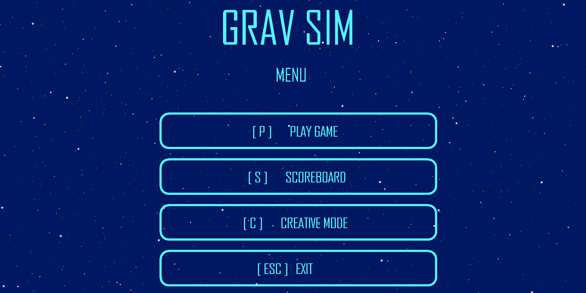
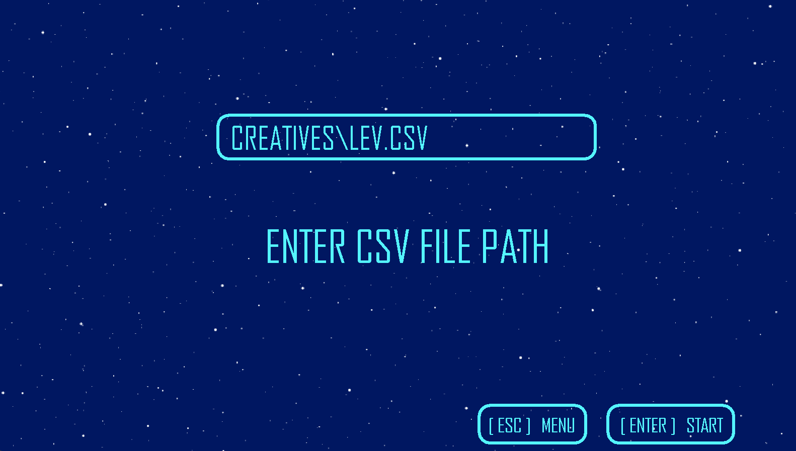
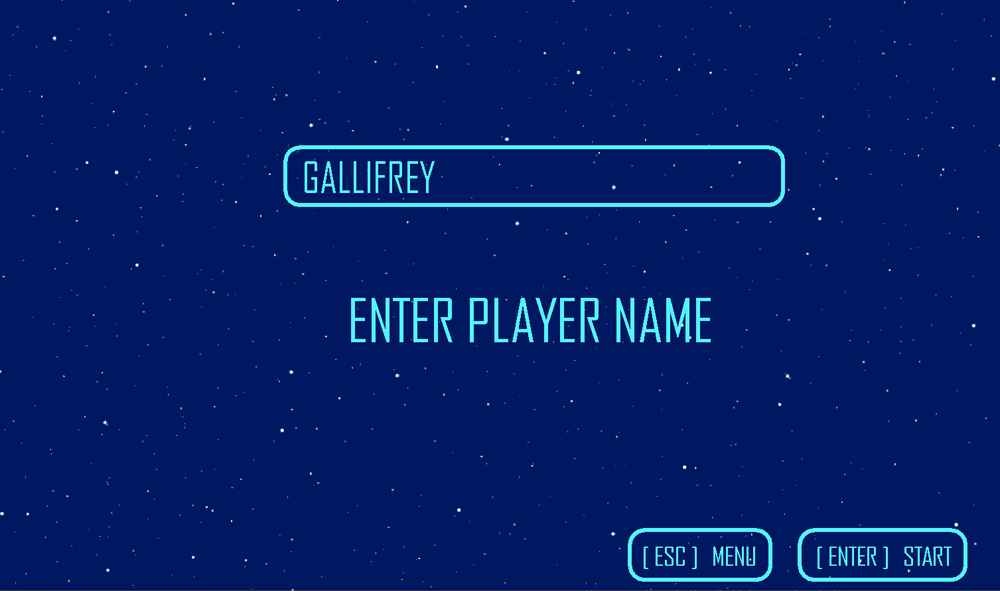
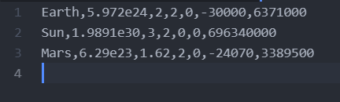
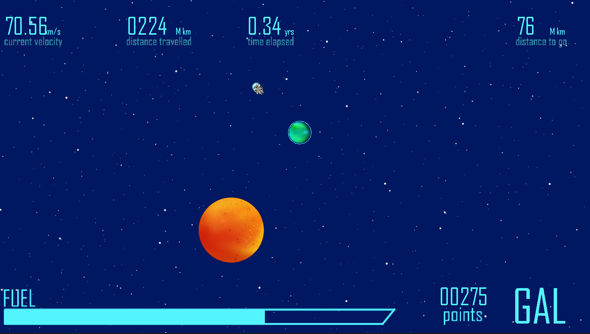
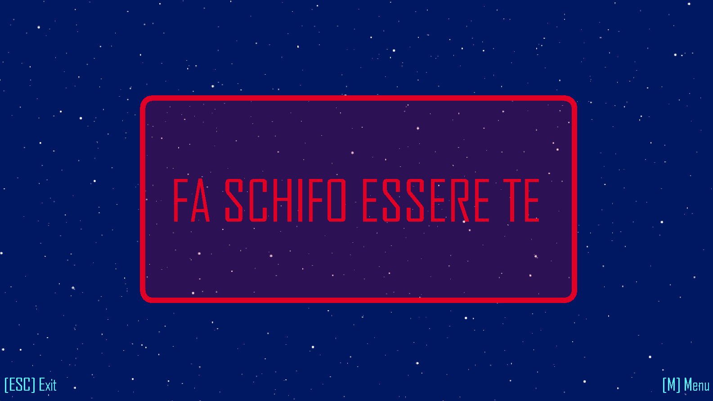
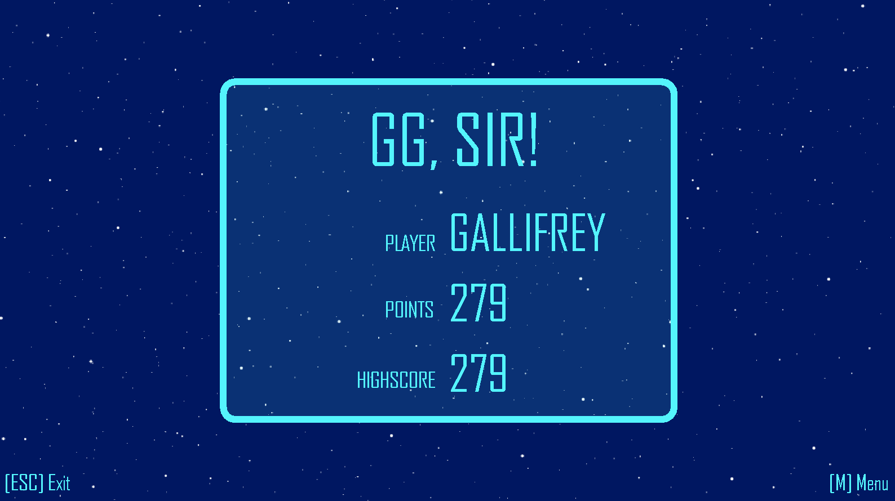

# Gravity Simulator Game
Project for the course **Object Oriented Analysis and Design with Java** that lets you explore orbital dynamics in form of a cool game!


```


```

## User Instructions
### Opening Screen

Here, the user has the option to choose between the following options:
```
P   → Play Game
S   → View Scoreboard
C   → Creative Mode
ESC → Exit
```
*NOTE: Insert screenshots when done*
#### Play Game
* There are two choices here:
  * **Creative Mode -**
    * Here, the user gets to place their own planets across the canvas and watch their movement. There is no 'gameplay' involved, but it's just as fun!
    * On choosing this option, the user is prompted to enter the path of a csv file. Details given below.
    
  * **Play Mode -**
    * Here, the user is prompted to enter a name. This name will be saved to the scoreboard.
    
    * Once this is done, the gameplay begins, and the goal is to navigate the rocket from its current position to the goal planet!

#### View Scoreboard
* Select this option to view the scoreboard.
* The scoreboard displays the **top 10** player names and their scores, ranked by score.
* This screen has a button that lets you return to the main screen.

#### Exit
* Quits the game window.

### Scoreboard

*Describe scoreboard screen*

### Gameplay
#### Creative Mode
Here, you can load in a `CSV File` with the following format:
```csv
PLANET_NAME | PLANET_MASS | PLANET_POSITION_X (IN AU) | PLANET_POSITION_X (IN AU) | PLANET_VEL_X (m/s) | PLANET_VEL_Y (m/s) | PLANET_RADIUS
```


And watch your configuration of a solar system come to life!


#### Play Mode
* You get to control a rocket. Different rockets have different masses and max accelerations. They also burn fuel at different rates.
* Your goal is to navigate the rocket to the goal planet (The green one)
* But here's the catch: You can only **accelerate or decelerate**.
* Exploit the gravitational fields of the surrounding planets to your advantage.
* Try to do so before the fuel runs out!



* It is game over if you crash into other planets, or take too long.



* Your score will be displayed with a congratulating message if you win.



## ***Allons-y!***
